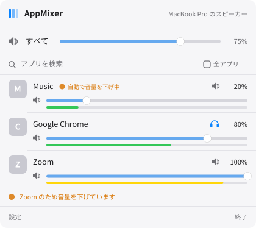

# AppMixer

**macOS でアプリケーションごとに音量を変える、メニューバー常駐のボリュームミキサー。**

再生中のアプリを一覧し、それぞれの音量を独立して調整できます。設定は出力デバイスごとに
記憶され、アプリ単位で出力先を分けたり、通話中に他の音を自動で絞ったりもできます。

<p align="center">
  <picture>
    <source media="(prefers-color-scheme: dark)" srcset="docs/images/mixer-dark.svg">
    
  </picture>
</p>

<p align="center"><sub>ミキサー画面のレイアウト</sub></p>

> **macOS 14.4 以降が必要です。**

---

## 主な機能

| | |
|---|---|
| **アプリ別の音量・ミュート** | 再生中のアプリを一覧し、それぞれ独立して音量を変えられます |
| **ライブレベルメーター** | 各アプリが実際に出している音量をリアルタイム表示（約30fps） |
| **出力デバイスごとの音量記憶** | 「Spotify × AirPods = 30%」「Spotify × スピーカー = 70%」を別々に記憶し、デバイスを挿し替えると自動で切り替わります |
| **アプリ別の出力先** | 「音楽はスピーカー、通話はヘッドフォン」のような振り分け |
| **通話中の自動ダッキング** | 会議が始まったらメディアを自動で絞り、終わったら戻します |
| **マスター音量・全体ミュート** | 既定の出力デバイスそのものを操作。F11/F12 の変更にも追従します |
| **ログイン時に起動** | メニューバー常駐アプリとして自動起動 |
| **検索・全アプリ表示** | 名前で絞り込み。停止中のアプリも表示できます |

音量の増減は約80msかけて滑らかにフェードするため、操作しても「プチッ」というノイズが出ません。

---

## 動作要件

- **macOS 14.4 以降** — Core Audio の Process Tap API を使うため
- **「システム音声録音」の許可**
  - システム設定 → プライバシーとセキュリティ → システム音声録音
  - ※マイクの許可ではありません。録音インジケータ（紫の点）は点きません

---

## インストール

[**Releases**](https://github.com/iam74k4/AppMixer-MacOS/releases/latest) から
`AppMixer-<version>.zip` をダウンロードします。

1. zip を展開して `AppMixer.app` を `/Applications` へ移動
2. 起動すると、メニューバーに 🎚 アイコンが出ます
3. 初回に「システム音声録音」の許可を求められるので **許可** してください

配布物は Developer ID 署名と公証を済ませてあるため、「開発元を検証できません」の
警告なしで開けます。

---

## ソースからビルドする

ビルドには **Xcode 15.3 以降**（macOS 14.4 SDK）と Command Line Tools が必要です。

```bash
git clone https://github.com/iam74k4/AppMixer-MacOS.git
cd AppMixer-MacOS
make run
```

`make run` はビルド → `dist/AppMixer.app` の生成 → 署名 → 起動までを行います。
初回起動時に「システム音声録音」の許可を求められるので、**許可**してください。
（許可の反映を確実にするため、許可後に一度終了して `make run` で再起動してください。）

### 繰り返しビルドするなら署名 ID を固定する

macOS の許可（TCC）とログイン項目の登録は**コード署名に紐づきます**。既定の ad-hoc 署名
だとビルドのたびに署名が変わり、そのたびに許可を求められます。

1. キーチェーンアクセス → 証明書アシスタント → 証明書を作成
   （名前: `AppMixer Dev`、種別: **コード署名**、自己署名）
2. その ID を指定してビルド:

```bash
make run IDENTITY="AppMixer Dev"
```

`dist/` は再ビルドで作り直されるため、常用するなら `/Applications` に置いてから
「ログイン時に起動」を有効にするのが安定します。

---

## 使い方

メニューバーの 🎚 アイコンをクリックするとミキサーが開きます。

- **スライダー** — そのアプリの音量。真下のバーが実際の出力レベル
- **🔊 ボタン** — そのアプリだけミュート
- **🔈 アイコン** — そのアプリの出力先を選択（既定の出力に戻すことも可能）
- **設定** — 自動ダッキングとログイン起動の設定を開閉

### 自動ダッキングについて
次のいずれかで発動します。

- **会議アプリが音を出した** — Zoom / Teams / Meet / Webex / FaceTime / Chime
- **マイクが使われた**（任意・既定でオン）— どの通話アプリでも拾えます

Discord や Slack は**通知音のたびに音楽が下がってしまう**ため、出音では発動させず
マイク検知に任せています。また通話アプリ自身は絞りません（相手の声が小さくなるため）。

### アプリ名の表示について
Edge / Chrome / Discord などは音声を**ヘルパープロセス**から出すため、素朴に列挙すると
`com.microsoft.edge.helper` のような名前になります。AppMixer は親プロセスを辿って
**本体アプリの名前とアイコンに解決**し、同じアプリの複数ヘルパーを 1 行にまとめます。

---

## 仕組み

macOS には「アプリの音量を設定する API」が存在しません。そのため AppMixer は
**アプリの音声を一度自分に通し、ゲインを掛けて出力し直す**という方法をとっています。

1. 対象アプリに **Process Tap** を張り、`.mutedWhenTapped` で元の出力を止める
2. 出力デバイスとタップを束ねた**プライベート集約デバイス**を作る
3. その **IOProc** で音量を掛け、ピークを計測して出力へ書き戻す

つまり AppMixer 自身がミキサーになります。音量を変えたアプリと、レベルを表示するために
ミキサーを開いている間の再生中アプリがこの経路を通り、それ以外の音声には手を触れません。

---

## 既知の制約

- **macOS 14.4 未満では動作しません**
- **出力デバイスの音声形式が合わない場合**（一部の HDMI・AVアンプ・オーディオIF など）は、
  そのアプリの音量調整を行いません。誤った音を出すより安全側に倒しています
- **増幅（100%超）はできません**。音割れを避けるため 0〜100% に制限しています
- 音量を変えたアプリの音声は AppMixer を経由するため、**AppMixer を終了すると
  それらのアプリは元の音量に戻ります**

---

## ライセンス

Copyright © 2026 iam74k4. All Rights Reserved.

閲覧を超える利用（複製・改変・再配布など）は許諾していません。詳細は [`LICENSE`](LICENSE) を参照してください。
